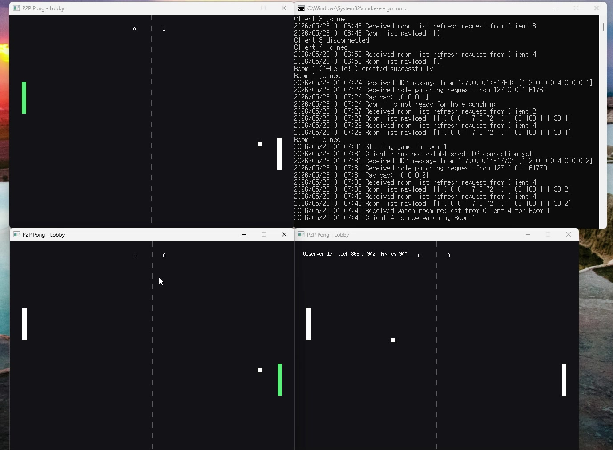
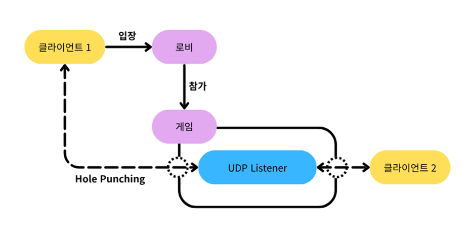
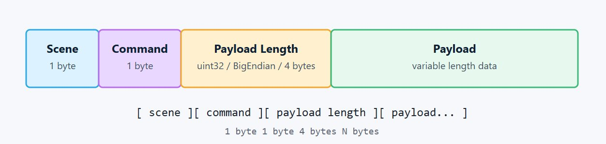

# Lockstep Pong

> UDP P2P 통신과 결정론적 시뮬레이션으로 구현한 실시간 1v1 Pong

서버가 모든 게임 상태를 관리하는 대신, **클라이언트 간 P2P UDP로 입력(input)만 교환**하고 양쪽이 **동일한 deterministic 로직**으로 게임 상태를 계산하는 lockstep 동기화 구조를 직접 구현한 프로젝트입니다. 서버 부하 절감과 패킷 경량화에 초점을 맞췄습니다.

<p align="center">
  
</p>

🎬 **[데모 영상 보기](https://youtu.be/vFVg0i2LPBg)**

<br>

## 왜 Pong인가?

복잡한 게임 콘텐츠보다 **동기화 검증에 최적화된 단순한 규칙**이 필요했습니다.

- **단순한 규칙, 명확한 승패** — 결과 비교로 동기화 성공 여부를 즉시 검증할 수 있음
- **입력 단순, 상태 직관적** — TCP/UDP 통신 구조와 deterministic simulation을 명확히 실험하기 적합
- **실시간성** — tick 단위 입력 교환·관전·리플레이 기능을 모두 구현·검증 가능

<br>

## 핵심 기술

### 1. TCP + UDP 하이브리드 통신

TCP 로비로 신뢰성을 확보한 뒤, UDP 홀펀칭으로 P2P 연결을 수립합니다. 로비는 안정성을, 게임 통신은 저지연·저비용을 첫 번째 목표로 삼았습니다.

<p align="center">
  
</p>

```go
func (s *Server) StartHolePunching(room *Room) {
    if len(room.Players) < 2 {
        return
    }
    p1 := room.Players[0]
    p2 := room.Players[1]

    // P1에게 P2의 공인 UDP 주소를 전송
    p1.Send <- MakePacket(SceneGame, CmdStartHolePunch, SerializeUDPAddr(p2.UDPAddr))
    // P2에게 P1의 공인 UDP 주소를 전송
    p2.Send <- MakePacket(SceneGame, CmdStartHolePunch, SerializeUDPAddr(p1.UDPAddr))

    p1.State = ClientStateGame
    p2.State = ClientStateGame
}
```

### 2. Deterministic 시뮬레이션

정수 연산과 고정 상수로 부동소수점 문제를 원천 차단했습니다. 양쪽 클라이언트가 동일한 로직을 실행하므로, **같은 입력 → 같은 결과**가 항상 보장됩니다.

CommandQueue는 각 tick에 양 플레이어의 입력이 모두 도착해야만 시뮬레이션을 진행합니다.

<p align="center">
  
</p>

```go
func (g *GameScene) handleLocalInput() {
    state := g.state
    futureTick := state.Tick + InputDelay
    input := keyboardAxis(ebiten.KeyArrowUp, ebiten.KeyArrowDown)

    state.PushCommand(futureTick, state.Player, input)

    if g.netplay != nil && g.netplay.IsReady() {
        g.netplay.SendLocalInput(futureTick, input)
        g.recordReplayInput(futureTick, input)
    }
}
```

### 3. ACK 기반 신뢰성 레이어

UDP 위에 입력 ACK / 재전송을 직접 구현했습니다. `unackedInputs`를 일정 주기로 재전송하여, **패킷 손실 상황에서도 동기화가 깨지지 않도록** 보장합니다.

### 4. 바이너리 패킷 프로토콜

`Scene(1B) + Command(1B) + Payload Length(4B) + Payload`의 경량 바이너리 구조로 통신 비용을 최소화했습니다.

<p align="center">
  
</p>

```go
func MakePacket(scene byte, command byte, payload []byte) []byte {
    header := make([]byte, 6)
    header[0] = scene
    header[1] = command
    binary.BigEndian.PutUint32(header[2:6], uint32(len(payload)))
    return append(header, payload...)
}
```

### 5. 리플레이 · 관전 시스템

서버는 게임 상태가 아닌 **입력만 저장**하므로, 저장된 입력을 다시 적재하면 실제 게임과 완벽히 동일한 시뮬레이션을 재생할 수 있습니다. 같은 입력 스트림을 관전자에게 실시간 브로드캐스트하면 라이브 관전이 됩니다.

<p align="center">
  
</p>

서버는 매 프레임 상태를 동기화하는 대신, **검증과 기록**이라는 최소한의 역할만 담당합니다.

- **관전 (Broadcast)** — tick별 입력 로그를 관전자에게 실시간 브로드캐스트
- **검증 (Verify)** — 게임 종료 시 두 플레이어의 `GameOverReport`를 비교해 결과 일치 확인
- **리플레이 (Replay)** — 검증이 완료된 입력 로그를 `.rep` 파일로 저장하여 동일 시뮬레이션 재생

<br>

## 아키텍처 요약

```
[Client 1] ──TCP── [Lobby Server] ──TCP── [Client 2]
     │            (매칭 · 홀펀칭 중개)            │
     │                                          │
     └──────────── UDP P2P (입력 교환) ──────────┘
                         │
              tick별 입력만 전송
                         │
        각자 동일한 deterministic Step() 실행
                         │
              → 양쪽 상태 항상 일치
```

- **로비 (TCP)** — 매칭, 방 관리, UDP 홀펀칭 중개
- **게임 (UDP P2P)** — tick 단위 입력 교환, ACK/재전송
- **시뮬레이션** — 정수 연산 기반 deterministic Step 함수
- **기록 (서버)** — 입력 로그 검증 및 `.rep` 저장

<br>

## 기술 스택

`Go` · `UDP` · `TCP` · `P2P Hole Punching` · `Lockstep` · `Deterministic Simulation` · `Ebiten`
  <sub>Made by <a href="https://github.com/shin1244">shin1244</a></sub>
</p>
