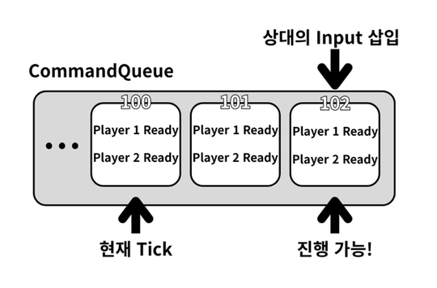
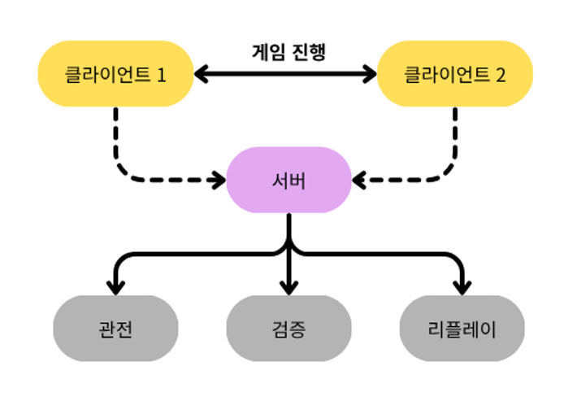

<div align="center">

# Lockstep Pong

UDP P2P 락스텝 기반 실시간 1v1 Pong.<br/>
**서버 비용**, **통신 지연**, **공정성** 세 가지에 초점을 맞춘 프로젝트입니다.

<br/>


<br/>

🎬 **[데모 영상](https://youtu.be/vFVg0i2LPBg)**

</div>

---

## 목표

서버 권위 구조는 안정적이지만, 서버가 매 틱 경기 상태를 계산·브로드캐스트하기 때문에 경기 수가 늘수록 연산·네트워크 비용도 함께 늘어납니다. **서버 비용을 최대한 줄인 실시간 대전 구조**를 만들어보고 싶어 시작한 프로젝트입니다.

- **낮은 서버 비용** — 서버가 경기 상태를 매 틱 계산하거나 브로드캐스트하지 않는다
- **통신 지연 절감** — 입력이 서버를 거치지 않고 상대에게 바로 도달한다

두 목표 모두 **서버를 거치지 않는 P2P 구조**로 풀 수 있다고 보고, Lockstep을 기반으로 설계했습니다. 다만 서버가 경기 상태를 모르게 되면서 클라이언트가 보낸 결과를 그대로 믿을 수밖에 없는 문제가 생겼고, 여기서 세 번째 목표가 추가됐습니다.

- **공정성** — 서버가 경기 결과를 독립적으로 검증할 수 있어야 한다

아래는 이 세 목표를 구현하며 부딪힌 문제와 해결 과정을 순서대로 정리한 내용입니다.

---

## 왜 Pong인가?

**동기화 검증에 최적화된 단순한 규칙**이 필요했습니다.

- **단순한 규칙** — 양쪽 화면을 눈으로 비교하는 것만으로 동기화 성공 여부를 즉시 확인
- **직관적** — TCP/UDP 구조와 결정론 시뮬레이션을 실험하기에 적합
- **실시간성** — 입력 동기화, 관전, 리플레이까지 얹기에 적합

---

## UDP P2P를 선택하다

낮은 서버 비용과 통신 지연 절감은 모두 **게임 트래픽이 서버를 거치지 않으면** 해결되는 문제였습니다. 그래서 경기 중에는 P2P 구조를 쓰기로 했습니다.

서버는 매칭과 UDP 홀펀칭만 담당하고, 연결이 끝나면 게임 데이터에서 손을 뗍니다. 전송은 TCP 대신 UDP를 쓰되 ACK·재전송처럼 게임에 필요한 기능만 직접 구현했습니다.

```go
// 서버: 두 피어에게 서로의 주소만 알려주고 게임에서 손을 뗀다
func (s *Server) StartHolePunching(room *Room) {
    p1, p2 := room.Players[0], room.Players[1]

    p1.Send <- MakePacket(SceneGame, CmdStartHolePunch, SerializeUDPAddr(p2.UDPAddr))
    p2.Send <- MakePacket(SceneGame, CmdStartHolePunch, SerializeUDPAddr(p1.UDPAddr))

    // 이후 서버는 이 경기의 게임 로직을 실행하지 않는다
    p1.State = ClientStateGame
    p2.State = ClientStateGame
}
```

덕분에 서버는 경기 상태를 계산·브로드캐스트하지 않게 됐고, 입력도 서버를 거치지 않게 됐습니다. 대신 새로운 문제가 남았습니다.

- UDP는 입력 하나만 유실돼도 두 클라이언트의 상태가 갈라진다
- 두 플레이어가 항상 같은 게임을 플레이하고 있음을 어떻게 보장할까?

---

## Lockstep 동기화

답은 즐겨 하던 **스타크래프트**에서 찾았습니다. 수백 개 유닛이 동시에 움직이는 RTS가 당시 네트워크 환경에서도 원활했던 이유는, **게임 상태가 아니라 입력만 주고받고 각 클라이언트가 같은 로직을 같은 순서로 실행**하기 때문이었습니다. 제 게임도 입력만 주고받는 구조였기에 그대로 적용했습니다.

### 구현

- **입력만 전송** — 좌표 대신 `위 / 아래 / 정지`
- **결정론 시뮬레이션** — 물리·충돌 모두 정수 연산
- **동기화 규칙** — 양쪽 입력이 모두 도착한 틱만 실행

<p align="center">
  
</p>

### 입력 유실

UDP는 도착을 보장하지 않으므로, 보낸 입력은 ACK를 받을 때까지 `unackedInputs`에 보관하고 100ms마다 재전송합니다. 유실되더라도 결국 같은 입력을 공유하게 됩니다.

### Input Delay

Lockstep은 양쪽 입력이 다 와야 다음 틱을 실행하기 때문에, 상대 패킷이 조금만 늦어도 게임이 멈췄습니다. 그래서 현재 입력을 바로 실행하지 않고 **현재 Tick + 3**에 예약해 전송하는 Input Delay를 적용했습니다. 그 틱이 실제로 실행될 때쯤이면 상대 입력도 대부분 도착해 있어 끊김이 크게 줄었습니다.

> 📌 **Trade-off** — 입력이 약간 늦게 반영되지만 플레이에 지장을 줄 정도는 아니며, 멈췄다 한꺼번에 진행되는 것보다 훨씬 자연스럽습니다.

<details>
<summary><b>입력을 미래 틱에 예약 + ACK 재전송 — 코드로 보기</b></summary>

<br/>

```go
// 지금 누른 입력을 "현재 틱 + InputDelay"에 예약해 미리 보낸다
func (g *GameScene) handleLocalInput() {
    state := g.state
    futureTick := state.Tick + InputDelay          // ← 왕복 시간을 벌기 위한 예약
    input := keyboardAxis(ebiten.KeyArrowUp, ebiten.KeyArrowDown)

    state.PushCommand(futureTick, state.Player, input)

    if g.netplay != nil && g.netplay.IsReady() {
        g.netplay.SendLocalInput(futureTick, input)
        g.recordReplayInput(futureTick, input)
    }
}

// 현재 틱은 양쪽 입력이 모두 준비됐을 때만 진행 (결정론 유지)
func (g *GameScene) simulateCurrentTick() {
    frame, ok := g.state.CommandQueue[g.state.Tick]
    if !ok || !frame.P1Ready || !frame.P2Ready {
        return                                      // 아직 안 왔으면 이 틱은 대기
    }
    g.state.Step(Input{Player1: frame.P1Input, Player2: frame.P2Input})
    delete(g.state.CommandQueue, g.state.Tick)
}

// UDP 손실 대응: ACK 안 온 입력을 주기적으로 재전송
func (n *NetplaySession) ResendUnackedInputs() {
    now := time.Now()
    for tick, pending := range n.unackedInputs {
        if now.Sub(pending.lastSentAt) < InputResendInterval {  // 100ms
            continue
        }
        n.sendInput(tick, pending.input)
        pending.lastSentAt = now
        n.unackedInputs[tick] = pending
    }
}
```

</details>

---

## 실시간 리플레이 · 관전

락스텝까지 구현하고 나니 다음으로 넣고 싶은 건 진행 중인 경기 관전이었습니다.

> **관전자는 경기 도중에 들어오는데, 현재 상황까지 어떻게 따라오게 만들까?**

현재 상태를 통째로 보내는 방법도 생각했지만, 지금껏 입력만 주고받던 구조와 맞지 않았습니다. 저는 그 답을 **스트리트 파이터 6의 관전 방식**에서 찾았습니다. 상태 대신 처음부터의 입력을 빠르게 재생해 현재 시점까지 따라가는 방식으로, 락스텝 덕분에 제 프로젝트도 이미 같은 조건을 갖추고 있었습니다.

문제는 입력이 P2P로 상대에게만 갔다는 점이었습니다. 관전자에게 입력을 중계하려면 서버가 먼저 그 입력을 갖고 있어야 하므로 클라이언트가 입력을 두 경로로 보내도록 바꿨습니다.

- **상대에게** — UDP P2P로 즉시 (실시간 플레이용)
- **서버에게** — 60틱마다 모아서 TCP로 배치 전송

두 경로가 분리돼 있어, 서버로 가는 배치 전송이 실시간 플레이 지연에 영향을 주지 않습니다. 서버는 방마다 입력을 Recorder에 쌓아 관전자에게 브로드캐스트하거나 리플레이 파일로 저장합니다.

```go
// 클라이언트: 입력을 모았다가 60개가 쌓이면 서버로 배치 전송
func (g *GameScene) recordReplayInput(tick uint32, input Axis) {
    g.recorder = append(g.recorder, ReplayFrame{Tick: tick, Input: input})
    if len(g.recorder) >= 60 {
        g.Flush()   // ReplayBatchCommand(TCP)로 전송
    }
}
```

- **리플레이** — 서버에 쌓인 입력을 `.rep`로 저장, 동일 로직에 다시 흘려보내 원본 경기를 그대로 재현
- **실시간 관전** — 서버는 입력이 갱신될 때마다 관전자에게 브로드캐스트하고, 관전자는 처음부터 재생하되 많이 뒤처지면 4배속 현재에 가까워지면 실시간 속도로 전환

관전자에게도 상태가 아닌 입력만 보내므로 서버 네트워크 비용은 매우 작게 유지됩니다.

<details>
<summary><b>관전자의 빨리 감기 + 입력 로그 저장 — 코드로 보기</b></summary>

<br/>

```go
// 관전자: 진행 상황에 뒤처지면 배속으로 따라잡고, 따라잡으면 실시간 속도로
func (o *ObserverScene) updateSpeed() {
    if o.state.Tick >= o.latestReceivedTick {
        o.speed = observerLiveSpeed
        return
    }
    lag := int(o.latestReceivedTick) - int(o.state.Tick)
    if o.speed == observerLiveSpeed && lag > observerCatchUpLagTicks {
        o.speed = observerCatchUpSpeed   // 많이 뒤처짐 → 4배속 빨리 감기
        return
    }
    if o.speed == observerCatchUpSpeed && lag <= observerLiveLagTicks {
        o.speed = observerLiveSpeed       // 거의 따라잡음 → 실시간 속도
    }
}
```

```go
// 서버: 경기 내내 쌓은 입력 로그를 틱 순서대로 .rep 파일로 저장 (상태가 아니라 입력만)
func saveReplay(room *Room) {
    ticks := make([]uint32, 0, len(room.Recorder))
    for tick := range room.Recorder {
        ticks = append(ticks, tick)
    }
    sort.Slice(ticks, func(i, j int) bool { return ticks[i] < ticks[j] })

    payload := append([]byte(nil), []byte("PONGREP1")...)               // 매직 헤더
    payload = binary.BigEndian.AppendUint32(payload, uint32(room.ID))
    payload = binary.BigEndian.AppendUint32(payload, uint32(len(ticks)))

    for _, tick := range ticks {
        frame := room.Recorder[tick]
        payload = binary.BigEndian.AppendUint32(payload, tick)
        payload = append(payload, byte(int8(frame.P1)), byte(int8(frame.P2)))
        payload = append(payload, boolByte(frame.P1Ready), boolByte(frame.P2Ready))
    }
    os.WriteFile(filepath.Join("replay", fmt.Sprintf("room_%d.rep", room.ID)), payload, 0644)
}
```

</details>

---

## 공정성 문제, 그리고 2XKO의 방식

게임은 목표대로 잘 돌아갔지만 실시간 대전이라면 반드시 챙겨야 할 **공정성**을 놓치고 있었습니다.

> **서버가 경기 상태를 모른다.** 한쪽이 "내가 이겼다"고 조작된 결과를 보내도 서버는 거짓 여부를 확인할 수 없습니다.

처음에는 양쪽 클라이언트가 보낸 결과가 서로 일치할 때만 신뢰하는 방식을 사용했습니다. 하지만 클라이언트가 보낸 결과를 결국 신뢰해야 한다는 점이 계속 마음에 걸렸습니다.

해결 방법을 고민하던 중 라이엇의 **[2XKO 온라인 플레이 방식](https://2xko.riotgames.com/ko-kr/news/dev/how-2xko-handles-online-play/)** 을 접했습니다. 클라이언트끼리는 기존과 같이 플레이하고 서버는 별도로 같은 게임을 시뮬레이션해 결과를 검증하는 구조입니다. 이미 관전·리플레이를 위해 양쪽 입력을 모두 저장하고 있었기 때문에, 그 입력으로 **서버가 경기를 한 번 더 실행하기만 하면** 됐습니다.

### 구현

- **로직 공유** — 게임 로직을 클라·서버 공용 `pongsim` 모듈로 분리
- **독립 재현** — 종료 후 저장된 입력만으로 처음부터 다시 시뮬레이션해 승자·점수를 서버가 직접 계산
- **결과 대조** — 서버 계산 결과와 클라이언트의 `GameOverReport`를 비교, 다르면 desync 또는 조작으로 판정

<details>
<summary><b>서버 검증 시뮬레이션 — 코드로 보기</b></summary>

<br/>

```go
// 서버: 기록된 입력만으로 경기를 처음부터 재현해 "정답"을 계산 (클라이언트와 동일한 pongsim 코어)
func VerifyRoom(room *Room) VerifyResult {
    state := sim.NewState(sim.Player1)

    // 기록된 양쪽 입력을 커맨드 큐에 적재
    var maxTick uint32
    for tick, frame := range room.Recorder {
        if frame.P1Ready {
            state.PushCommand(tick, sim.Player1, sim.Axis(frame.P1))
        }
        if frame.P2Ready {
            state.PushCommand(tick, sim.Player2, sim.Axis(frame.P2))
        }
        if tick > maxTick {
            maxTick = tick
        }
    }

    // 양쪽 입력이 준비된 틱만 순서대로 진행 (클라이언트와 동일한 규칙)
    for state.Winner == 0 && state.Tick <= maxTick {
        frame := state.CommandQueue[state.Tick]
        if frame == nil || !frame.P1Ready || !frame.P2Ready {
            break
        }
        state.Step(sim.Input{Player1: frame.P1Input, Player2: frame.P2Input})
    }

    return VerifyResult{
        Winner: state.Winner, LeftScore: state.LeftScore,
        RightScore: state.RightScore, GameOverTick: state.GameOverTick,
        Completed: state.Winner != 0,
    }
}

// 서버 정답과 클라이언트 보고가 어긋나면 불일치(조작 의심)로 판정
func compareReport(report GameOverReport, result VerifyResult) (reason string, ok bool) {
    if int32(result.Winner) != report.Winner {
        return "winner 불일치", false
    }
    if result.LeftScore != int(report.LeftScore) || result.RightScore != int(report.RightScore) {
        return "score 불일치", false
    }
    return "", true
}
```

</details>

> 📌 **Trade-off** — 결국 서버가 게임을 계산하게 됐지만, 여전히 매 틱 상태를 브로드캐스트하지는 않습니다. 검증은 경기 종료 후 단 한 번뿐이고 Pong 시뮬레이션도 가벼워 부담이 작습니다. 상태 브로드캐스트는 없애고, 공정성을 위한 최소 계산만 서버에 남긴 구조입니다.

---

## 아키텍처

- **로비 (TCP)** — 매칭, 방 관리, UDP 홀펀칭 중개. 신뢰성이 필요한 제어 신호만
- **게임 (UDP P2P)** — 틱 단위 입력 교환, ACK/재전송. 저지연·저비용 우선
- **시뮬레이션 (`pongsim` 공유 모듈)** — 정수 연산 결정론 `Step()`. 클라이언트와 서버가 같은 코드를 실행
- **검증·기록 (서버)** — 입력 로그로 경기를 독립 재현해 결과 대조, `.rep` 저장. 상태 브로드캐스트는 없음

<p align="center">
  
</p>

**모듈 구조**

```
PONG/
├─ sim/       # pongsim — 결정론 시뮬레이션 코어 (클라·서버 공유)
├─ client/    # Ebiten 그래픽 클라이언트 (게임·리플레이·관전 씬)
└─ server/    # TCP 로비 + UDP 중개 + 검증/기록 서버
```
